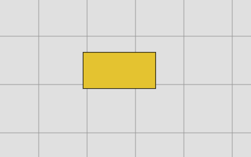
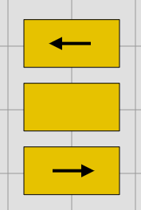
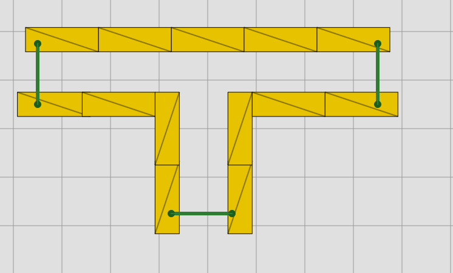
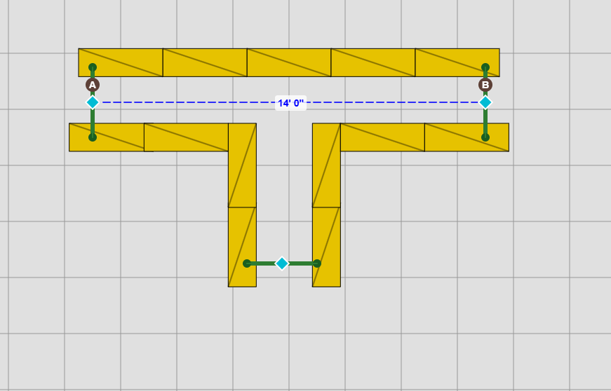
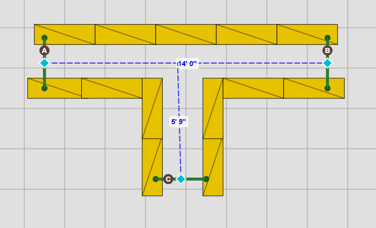
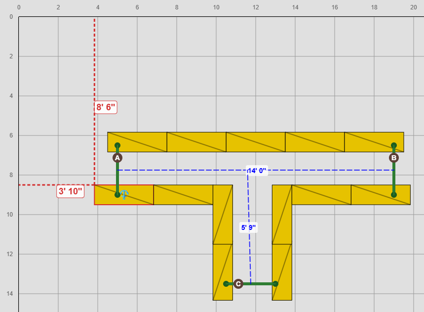
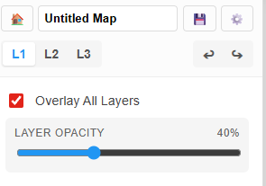

Building a tunnel is a great way to learn K9 Course Builder. Building a tunnel involves a few steps. First, build your base layer. Select the "Bale" tool on the left hand side, and then click to place bales. The default position looks like this: 

And then you can modify the bale. Multiple ways exist to do this, but most involve selecting a bale first. To select the bale, click on it once, and it will gain a blue highlight. 

## Orientation
From there, you can change its orientation, as you'll need "tall" bales to build a tunnel. You can change the orientation by:
- Keyboard: Hit the "o" key on your keyboard to cycle through the three orientations
- Sidebar: Hitting the "Orient" button on the left sidebar
- Bottom context menu: Hitting the F/T/P buttons on the menu that appears at the bottom
- Right-click menu: Right-click the bale and select "tall" from that menu

## Rotation
To rotate a bale, ensure it is selected as above. Then, you can rotate by:
- Keyboard: Hit the "r" key on your keyboard to rotate it in 15-degree increments. Or, use Shift + "r" to rotate it in 90-degree increments. 
- Sidebar: The rotate button is near the bottom. Select the rotate button, then click the bale you want to rotate.
- Bottom context menu: Hit the rotate icon, it is to the left of the "Deselect" text.
- Right click menu: You can rotate in 45- or 90-degree increments.

## Lean
You won't use lean in a tunnel base layer, but it is accessed similarly. Only "flat" bales can have a lean to them:
- Keyboard: Hit the "L" key on your keyboard to cycle through the three orientations
- Sidebar: Hitting the "Lean" button on the left sidebar
- Bottom context menu: Hitting the arrow buttons on the menu that appears at the bottom
- Right-click menu: Right-click the bale and select "left" "right" or "none" from that menu. 

## Placing Bales Quickly
All bales are placed in that default flat horizontal position, so it's easier to copy/paste bales to work quickly. To copy/paste a single bale that has been selected (blue outline):
- Keyboard: Standard keyboard shortcuts. Ctrl+C to copy, Ctrl+V to paste.
- Sidebar: The Copy and Paste buttons are at the bottom of the left sidebar.
- Right click menu: The copy, cut, and paste buttons are at the top of the right click menu.

## Multiple Selections
It makes sense sometimes to copy and paste multiple bales. Copy/paste works on whatever is selected, so select multiple bales to work even faster. You can select multiple bales by:
- Keyboard: Hold Shift while clicking multiple bales
- Mouse: Click and drag on an empty part of the editor grid to create a selection rectangle over the bales you want to select.

After selecting the bales you want to copy/paste, use those features as above. 

Build your entire base layer for the tunnel. Don't worry if you're off by a few inches, you can always adjust bale placement later.

Then, you'll enter the tunnel manager to start adding the official tunnel features. It can be found on the sidebar under the "Managers" subheading.

## Tunnel Manager
The tunnel manager is a special sidebar. It has two functions at the top: setting your board edges and drawing your tunnel paths. The set edges tool is selected by default. 

### Setting Edges
Click once on a bale at the tunnel entrance. Click on the other bale at the same mouth of the tunnel. A line appears. It's okay if it's a bit crooked, you can move those green dots once you exit the tunnel manager.

After marking all of your entrances, switch the tool at the top from Set Edges to Draw Path.

### Drawing Paths
Blue diamonds appear at the center of every tunnel entrance line you've marked. Now, just click one of those diamonds to start a path. Click at every intersection and turn. For this multi portal tunnel I'm building in this picture, I will click on the left entrance first, then the right entrance. 

To finish this tunnel, we need to connect the other portal. Click once on the bottom portal, and then click the blue line that already exists to connect them. 

And you're done with the base layer! Now, return to the editor to finish up placing any supporting bales and mark an anchor bale if your tunnel is not supported by a wall. To mark an anchor bale, simply select an existing bale and click the Anchor icon on the left sidebar ("Make Anchor"), the bottom toolbar (icon only), or the right-click context menu.

When you're ready to start building the second layer, your layer toggles are at the top of the sidebar, right below the name of your map. Select L1, L2, or L3 to jump between. Bales on different layers are different colors. 

